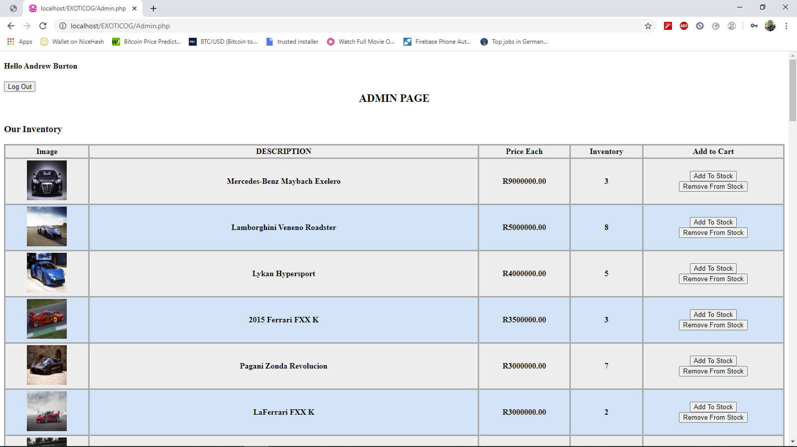

# ExoticOG-Online-Store
I created a website where customers can shop online. The website allows customers to log in, add and remove items from their cart, check-out, and view their history. It also allows admins to update stock, and view stock quantities.

Open the folder "DB" and run DBConn, once you have completed run populate database to import database structure.
note: modify the DBConn.php to link it to your mySQL database.
 
Start the website by navigating to myShop.php on your browser.

This is the main page which is displayed when myShop.php is executed

This screenshot demonstates when a user adds items to the shopping cart without logging in.

Once the user has completed viewing all items the next step is to check-out. 
The following image displays a user after logged in as well as welcoming the user with the option checkout.

After the user has succesfully logged in the user is able to check out their order/purchase.
The following image displays a user whom has succesfully checkout their order and is notified their order is being processed.

While the user has checked out their order, the user is able to see their purchase history which is below their current order along with total purchase history ammount.

The following image depicts the admin page which allows the admin to manipulate the inventory.

